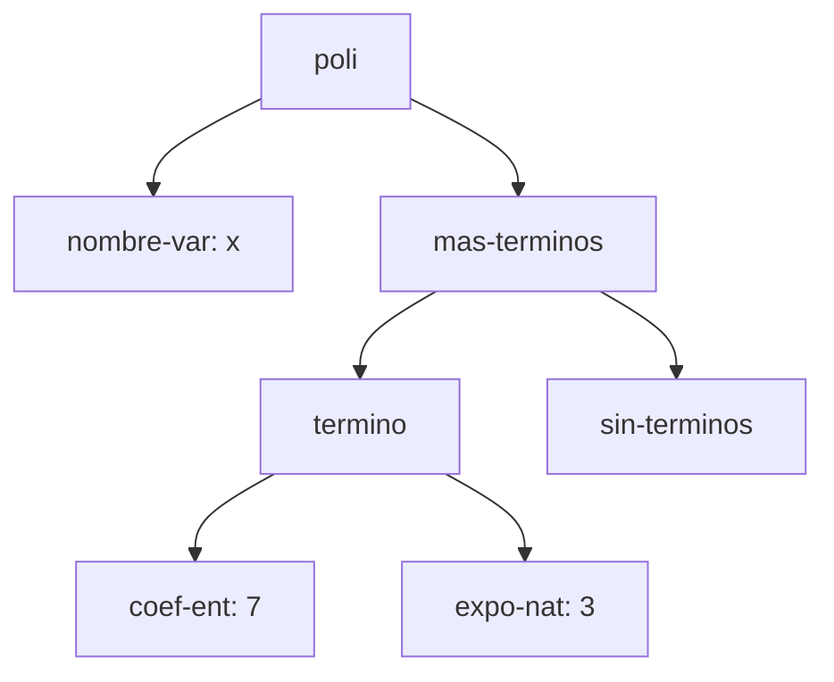
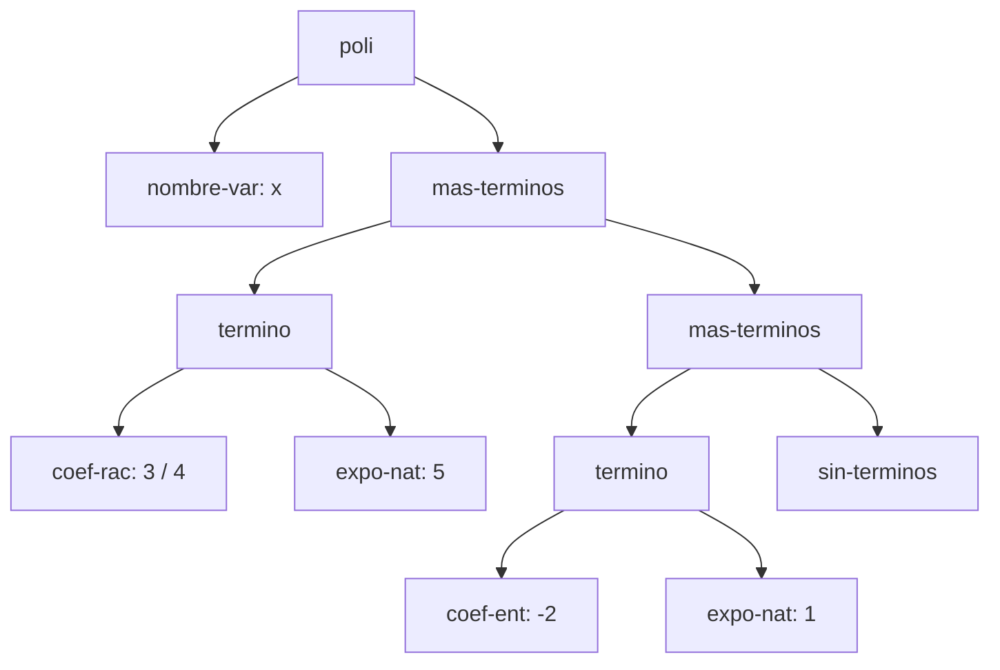
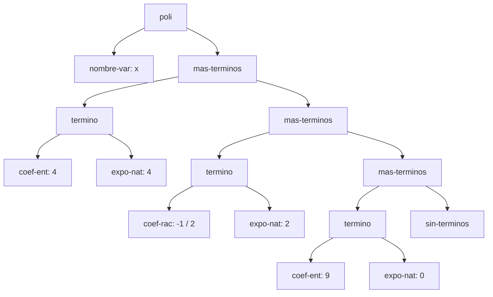
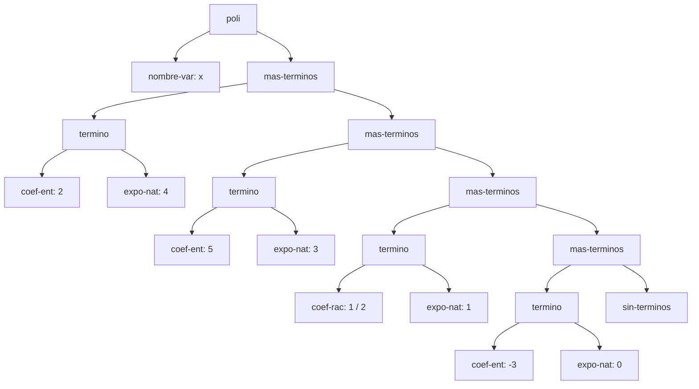

# Informe de AST — Taller 1: polinomios dispersos

> **Plantilla de entrega.** Copie este archivo a `docs/informe-ast.md`
> dentro del repositorio del grupo y reemplace los marcadores
> `{{...}}` con su contenido. **No elimine las secciones
> obligatorias.** No se aceptan PDF, DOCX ni imágenes insertadas:
> todo el documento debe ser Markdown, las fórmulas en LaTeX
> (`$...$` / `$$...$$`) y los diagramas en Mermaid.
>
> Este taller no pide traza de evaluación ni cadena de ambientes; el
> intérprete llega en el Taller 2.

**Curso:** Fundamentos de Interpretación y Compilación de Lenguajes
de Programación — Universidad del Valle, Sede Tuluá.

**Integrantes del grupo:**

| Nombre | Código | Correo institucional |
|--------|--------|----------------------|
|Adriana Milena Noscue Dagua| 2477336|adriana.noscue@correounivalle.edu.co |
|Sebastian Cucalon Astorquiza| 2477344|sebastian.cucalon@correounivalle.edu.co |
|Santiago Torres Rojas|2380301 |santiago.torres.rojas@correounivalle.edu.co |
|Nicolle Camila Hoyos Puin|2380608 |nicolle.hoyos@correounivalle.edu.co |

---

## 1. Gramática considerada

Esta es la gramática del enunciado. Los nombres del recuadro son los
constructores que deben aparecer como etiquetas en los diagramas de la
sección 2.

```bnf
<polinomio>   ::= <variable> <terminos>
                   poli(var, terms)

<variable>    ::= <symbol>
                   nombre-var(s)

<terminos>    ::= '()
                   sin-terminos()
              ::= <termino> <terminos>
                   mas-terminos(term, resto)

<termino>     ::= <coeficiente> <exponente>
                   termino(coef, expo)

<coeficiente> ::= <int>
                   coef-ent(n)
              ::= <int> "/" <int>
                   coef-rac(num, den)

<exponente>   ::= <int>
                   expo-nat(k)
```

Indique cómo se realiza cada no terminal en su implementación con
`define-datatype`:

| No terminal | Variantes del datatype | Campos |
|---|---|---|
| `<polinomio>` | `poli` | `var` (variable), `terms` (términos) |
| `<terminos>` | `sin-terminos`, `mas-terminos` | `(ninguno)`<br>`term` (término), `resto` (términos) |
| `<termino>` | `termino` | `coef` (coeficiente), `expo` (exponente) |
| `<coeficiente>` | `coef-ent`, `coef-rac` | `n` (entero)<br>`num` (numerador), `den` (denominador) |
| `<exponente>` | `expo-nat` | `k` (entero no negativo) |

---

## 2. Ejemplos de AST

> Los cuatro ejemplos que siguen son los que pide el enunciado. Cada
> uno lleva el polinomio escrito en notación matemática, el AST como
> diagrama Mermaid con los nombres de los constructores en los nodos,
> y una explicación breve.
>
> El nodo del final de la lista de términos, `sin-terminos`, se dibuja
> siempre: es el caso base de la recursión y sin él el árbol queda
> incompleto.

### Ejemplo 1 — un solo término con coeficiente entero

**Polinomio:** $p_1 = {{7x^{3}}}$

**Construcción:**

```scheme
{{(poli (nombre-var 'x)
        (mas-terminos (termino (coef-ent 7) (expo-nat 3))
                      (sin-terminos)))}}
```

**AST:**



**Explicación:** El nodo `nombre-var: x` indica la variable del polinomio. La lista de términos se compone de un único nodo `mas-terminos` que contiene la estructura `termino` y se cierra explícitamente con `sin-terminos` como caso base. El coeficiente (`coef-ent: 7`) y el exponente (`expo-nat: 3`) se separan en nodos individuales para mantener la abstracción y el desacoplamiento de la representación de datos.

---

### Ejemplo 2 — dos términos, uno con coeficiente racional

**Polinomio:** $p_2 = {{\frac{3}{4}x^{5} - 2x}}$

**Construcción:**

```scheme
(poli (nombre-var 'x)
      (mas-terminos (termino (coef-rac 3 4) (expo-nat 5))
                    (mas-terminos (termino (coef-ent -2) (expo-nat 1))
                                  (sin-terminos))))
```

**AST:**



**Explicación:** El subárbol del coeficiente racional usa el nodo `coef-rac: 3 / 4` especificando numerador y denominador de forma independiente. El invariante de orden decreciente se evidencia en que el primer hijo `mas-terminos` alberga al término de mayor exponente ($5$), el cual apunta en su rama derecha al término de exponente menor ($1$).

---

### Ejemplo 3 — tres o más términos, con término independiente

**Polinomio:** $p_3 = 4x^{4} - \frac{1}{2}x^{2} + 9$

**Construcción:**

```scheme
(poli (nombre-var 'x)
      (mas-terminos (termino (coef-ent 4) (expo-nat 4))
                    (mas-terminos (termino (coef-rac -1 2) (expo-nat 2))
                                  (mas-terminos (termino (coef-ent 9) (expo-nat 0))
                                                (sin-terminos)))))
```

**AST:**



**Explicación:** El término independiente ($9$) no requiere un constructor especial; se representa de forma estándar asignándole un exponente $0$ mediante el nodo `expo-nat: 0`, manteniendo así una estructura sintáctica homogénea en toda la lista de términos.

---

### Ejemplo 4 — el resultado de `(sumar p q)`

Use los polinomios $p$ y $q$ del ejemplo de la Parte 3 del enunciado.

**Operandos:**

- $p = 5x^{3} - 3x^{2} + \frac{1}{2}x + 4$
- $q = 2x^{4} + 3x^{2} - 7$

**Resultado:** $p + q = 2x^{4} + 5x^{3} + \frac{1}{2}x - 3$

**AST del resultado:**



**Origen de cada nodo.** Complete la tabla: por cada término del
resultado, de cuál operando salió, y aparte los términos que se
cancelaron y por eso no aparecen en el árbol.

| Término del resultado | Viene de | Observación |
|---|---|---|
| $2x^{4}$ | $q$ | Proviene de $q$; $p$ no posee término de grado 4. |
| $5x^{3}$ | $p$ | Proviene de $p$; $q$ no posee término de grado 3. |
| $\frac{1}{2}x^{1}$ | $p$ | Proviene de $p$; $q$ no posee término de grado 1. |
| $-3x^{0}$ | Suma de $p$ y $q$ | Suma de los términos independientes ($4 + (-7) = -3$). |

**Términos cancelados:** El término de grado 2 ($x^{2}$) presente en $p$ con coeficiente $-3$ y en $q$ con coeficiente $3$ se canceló debido a que $(-3) + 3 = 0$. Por el invariante de simplificación del TAD de polinomios dispersos, ningún término con coeficiente nulo puede guardarse en la lista, obligando a omitirlo por completo del árbol de sintaxis abstracta.

---

## 3. Referencias

- Friedman, D. P., & Wand, M. *Essentials of Programming Languages*,
  3.ª ed., MIT Press, 2008. Sección 2.1 (especificación de datos),
  sección 2.2 (representaciones de un TAD), sección 2.4
  (`define-datatype` y `cases`).
- Documentación oficial del lenguaje Racket (`#lang eopl`): https://docs.racket-lang.org/eopl/
