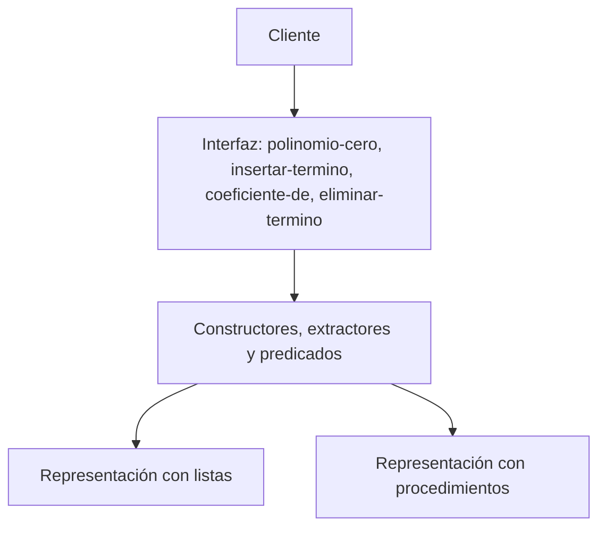

# Informe de corrección — Taller 1: polinomios dispersos


**Curso:** Fundamentos de Interpretación y Compilación de Lenguajes

de Programación — Universidad del Valle, Sede Tuluá.

**Integrantes del grupo:**


| Nombre | Código | Correo institucional |
|---|---:|---|
| Adriana Milena Noscue Dagua | 2477336 | adriana.noscue@correounivalle.edu.co |
| Sebastian Cucalon Astorquiza | 2477344 | sebastian.cucalon@correounivalle.edu.co |
| Santiago Torres Rojas | 2380301 | santiago.torres.rojas@correounivalle.edu.co |
| Nicolle Camila Hoyos Puin | 2380608 | nicolle.hoyos@correounivalle.edu.co |

---

## 1. Marco formal

### 1.1 Corrección de programas recursivos

Sea $f : A \to B$ una función y $A$ un conjunto definido recursivamente. Sea $P_f$ un programa recursivo en Racket que pretende 

calcular $f$. Decimos que $P_f$ es correcto con respecto a su

especificación si se cumple:

$$

\forall a \in A \,:\, P_f(a) = f(a)

$$

La estrategia de demostración es **inducción estructural** sobre $A$.

Aquí $A$ es el conjunto de listas de términos que genera la gramática:

- **Caso base:** $a = \text{sin-terminos}()$, y se verifica

  $P_f(a) = f(a)$ directamente.

- **Caso inductivo:** $a = \text{mas-terminos}(t, r)$. Se asume la

  **hipótesis de inducción** $P_f(r) = f(r)$ sobre el resto de la

  lista y se demuestra $P_f(a) = f(a)$.

Si alguna de sus funciones quedó escrita con un acumulador en lugar de recursión estructural, la corrección se argumenta con una invariante del acumulador y

no con la hipótesis de inducción: enuncie la invariante, demuestre que vale al inicio, que cada paso la conserva y que al terminar implica la post-

condición.

### 1.2 El invariante de la representación

Las cuatro condiciones del enunciado se enuncian como una única propiedad sobre polinomios. Sea $p$ un polinomio con términos

$t_1, t_2, \ldots, t_n$, donde $t_i = (c_i, e_i)$:

$$

\mathrm{Inv}(p) \equiv

\underbrace{\forall i < n : e_i > e_{i+1}}_{\text{orden estricto}}

\ \land\

\underbrace{\forall i : c_i \neq 0}_{\text{sin ceros}}

\ \land\

\underbrace{\forall i : e_i \in \mathbb{N}}_{\text{exponentes naturales}}

\ \land\

\underbrace{\forall i : \mathrm{red}(c_i)}_{\text{racionales reducidos}}

$$

donde $\mathrm{red}\left(\frac{a}{b}\right)$ abrevia

$b > 0 \,\land\, \mathrm{mcd}(|a|, b) = 1$, y un coeficiente entero se toma como el racional de denominador $1$.

---

## 2. Funciones analizadas

### 2.1 Corrección de `coeficiente-de`

**Especificación.**

- **Tipo:** `coeficiente-de : polinomio × exponente -> coeficiente`

- **Pre-condición:** $\mathrm{Inv}(p)$ y $e \in \mathbb{N}$ (el exponente es un entero no negativo).

- **Post-condición:** si el exponente $e$ aparece en $p$ asociado al

coeficiente $c$, entonces $r=c$; si el exponente $e$ no aparece en $p$, la función levanta `eopl:error`.

**Código.**

```racket

(define coeficiente-de

  (lambda (p exponente)

    (if (not (and (integer? exponente)

                  (>= exponente 0)))

        (eopl:error 'coeficiente-de

                    "El exponente debe ser un entero no negativo")

        (cases polinomio p

          (poli (var terms)

                (buscar-coeficiente

                 terms

                 exponente))))))

(define buscar-coeficiente

  (lambda (terms exponente)

    (cases terminos terms

      (sin-terminos ()

                    (eopl:error 'coeficiente-de

                                "El exponente no existe"))

      (mas-terminos (term resto)

                    (cases termino-tad term

                      (termino (coef expo)

                               (let ((expo-actual

                                      (valor-exponente expo)))

                                 (cond

                                   ((= exponente expo-actual)

                                    (valor-coeficiente coef))

                                   ((> exponente expo-actual)

                                    (eopl:error

                                     'coeficiente-de

                                     "El exponente no existe"))

                                   (else

                                    (buscar-coeficiente

                                     resto

                                     exponente))))))))))

```

**Demostración.**

- **Caso base** ($\text{sin-terminos}$): Cuando $\text{terms} = \text{sin-terminos}()$, no hay términos que evaluar. La condición `(sin-terminos? terms)` se evalúa como verdadera y la función ejecuta inmediatamente `(eopl:error ...)`. Esto cumple de manera exacta con la especificación de retornar error cuando el exponente no se encuentra presente.

 $$

 P_f(\text{sin-terminos}()) = \text{error} = f(\text{sin-terminos}())

 $$

- **Caso inductivo** ($\text{mas-terminos}(t, r)$): Sea $t = (c_{\text{act}}, e_{\text{act}})$. Se asume la hipótesis de inducción $P_f(r) = f(r)$ para la cola de términos $r$. Evaluamos tres casos:

  1. Si $e = e_{\text{act}}$, la función retorna $c_{\text{act}}$, cumpliendo la post-condición.

  2. Si $e < e_{\text{act}}$, por la H.I. la llamada recursiva buscar-coeficiente(r, e) retorna $f(r)$, buscando correctamente el coeficiente en el resto de la lista.

  3. Si $e > e_{\text{act}}$, por el orden estrictamente decreciente garantizado por $\mathrm{Inv}(p)$, sabemos que $\forall t_j \in r, e_j < e_{\text{act}} < e$. Es imposible que $e$ se encuentre en $r$, por lo que se corta la búsqueda en $O(1)$ y se levanta `eopl:error` sin necesidad de recorrer el resto de la lista.

  $$

  P_f(\text{mas-terminos}(t, r)) = f(\text{mas-terminos}(t, r))

  $$

- **Levantamiento del error.** Se levanta el error si se alcanza $\text{sin-terminos}()$ o si $e > e_{\text{act}}$, casos donde es matemáticamente imposible que el término exista. Si el término existe, el orden estricto garantiza que la búsqueda se detendrá únicamente en el caso $e = e_{\text{act}}$, retornando el coeficiente sin arrojar error.

- **Terminación.** La medida es el número de términos en la lista, $\mu(\text{terms}) = \vert{}\text{terms}\vert{} \in \mathbb{N}$. En cada llamada recursiva la longitud disminuye estrictamente en $1$ ($\mu(r) = \mu(\text{terms}) - 1$), con cota inferior $0$.

**Conclusión:** La función `coeficiente-de` es totalmente correcta con respecto a su especificación.

---

### 2.2 Corrección de `eliminar-termino`

**Especificación.**

- **Tipo:** `eliminar-termino : polinomio × exponente -> polinomio`

- **Pre-condición:** $\mathrm{Inv}(p)$ y $e \in \mathbb{N}$ (entero no negativo).

- **Post-condición:** el resultado contiene **exactamente** los

  términos de $p$ menos el de exponente $e$. Formalmente:

  $$

  \text{terminos}(r) = \text{terminos}(p) \setminus \{(c, e)\}

  $$

  y la función levanta `eopl:error` si $e$ no aparece en $p$.

**Código.**

```racket
(define eliminar-termino

  (lambda (p exponente)

    (if (not (and (integer? exponente)

                  (>= exponente 0)))

        (eopl:error 'eliminar-termino

                    "El exponente debe ser un entero no negativo")

        (cases polinomio p

          (poli (var terms)

                (poli

                 var

                 (eliminar-de-terminos

                  terms

                  exponente)))))))

(define eliminar-de-terminos

  (lambda (terms exponente)

    (cases terminos terms

      (sin-terminos ()

                    (eopl:error 'eliminar-termino

                                "El exponente no existe"))

      (mas-terminos (term resto)

                    (cases termino-tad term

                      (termino (coef expo)

                               (let ((expo-actual

                                      (valor-exponente expo)))

                                 (cond

                                   ((= exponente expo-actual)

                                    resto)

                                   ((> exponente expo-actual)

                                    (eopl:error

                                     'eliminar-termino

                                     "El exponente no existe"))

                                   (else

                                    (mas-terminos

                                     term

                                     (eliminar-de-terminos

                                      resto

                                      exponente)))))))))))

```

**Demostración.**

- **Caso base** ($\text{sin-terminos}$): Si $terms = \text{sin-terminos}()$, no hay términos que eliminar. Se ejecuta directamente `eopl:error`, lo cual satisface la post-condición de fallar cuando $e$ no está en el polinomio.

- **Caso inductivo** ($\text{mas-terminos}(t, r)$): Sea $t = (c_{\text{act}}, e_{\text{act}})$. Asumimos la H.I. de que eliminar-de-terminos(r, e) elimina correctamente el término de exponente $e$ de $r$.

  1. Si $e = e_{\text{act}}$, se retorna $r$, eliminando el primer término. Los términos resultantes corresponden exactamente a $\text{terminos}(p) \setminus \{(c, e)\}$.

  2. Si $e < e_{\text{act}}$, por H.I. la llamada recursiva elimina el término de $r$ devolviendo $r'$. Se reconstruye la lista como $\text{mas-terminos}(t, r')$.

  3. Si $e > e_{\text{act}}$, dado $\mathrm{Inv}(p)$, $e$ no está en $r$ y se levanta `eopl:error`.

- **Preservación del invariante:** Quitar un elemento de una secuencia decreciente produce una subsecuencia que conserva el orden estrictamente decreciente ($e_i > e_{i+1}$). Tampoco introduce coeficientes en cero ni altera los coeficientes racionales reducidos. Por ende, el resultado preserva $\mathrm{Inv}(p')$.

- **Terminación:** La medida $\mu(\text{terms}) = \vert{}\text{terms}\vert{}$ se reduce en $1$ en cada llamada sobre el resto de la lista, acotada inferiormente por $0$.

**Conclusión:** La función `eliminar-termino` es correcta y preserva el invariante.

---

### 2.3 `insertar-termino` preserva el invariante

**Enunciado.** Si $\mathrm{Inv}(p)$ vale antes de la llamada, entonces

$\mathrm{Inv}(\texttt{insertar-termino}(p, c, e))$ vale sobre el

resultado.

**Código.**

```racket

(define insertar-termino

  (lambda (p coeficiente exponente)

    (if (not (and (integer? exponente)

                  (>= exponente 0)))

        (eopl:error 'insertar-termino

                    "El exponente debe ser un entero no negativo")

        (if (not (and (rational? coeficiente)

                      (exact? coeficiente)))

            (eopl:error 'insertar-termino

                        "El coeficiente debe ser un número racional exacto")

            (if (= coeficiente 0)

                p

                (cases polinomio p

                  (poli (var terms)

                        (poli

                         var

                         (insertar-en-terminos

                          terms

                          coeficiente

                          exponente)))))))))

```

**Demostración por casos.** Cubra los tres casos del enunciado y

verifique en cada uno las cuatro condiciones del invariante:

- **Caso A — el exponente es nuevo.** El nuevo término se inserta antes

  del primer término cuyo exponente sea menor que $e$. Como los

  exponentes originales están en orden estrictamente decreciente, al

  insertar $e$ en esta posición se conserva dicho orden.

  Si $e$ es mayor que el primer exponente, el nuevo término queda al

  inicio. Si es menor que todos los exponentes existentes, queda al

  final. En ambos casos se mantiene el orden estrictamente decreciente.

  Además, si el coeficiente recibido es cero, la función retorna el

  polinomio original sin modificarlo. Esto evita introducir un término

  con coeficiente cero y, por tanto, conserva la segunda condición del

  invariante.

- **Caso B — el exponente ya existía y la suma no es cero.** Si ya

  existe un término $(c,e)$ y se inserta otro coeficiente $c'$ con el

  mismo exponente, la función calcula $c+c'$ y reemplaza el término por

  $(c+c',e)$.

  Como el exponente permanece igual, su posición dentro de la lista no

  cambia y se conserva el orden estrictamente decreciente.

  Si $c+c'\neq0$, tampoco se introduce un coeficiente cero. Además, los

  coeficientes utilizados son racionales exactos y la función

  `construir-coeficiente` obtiene el numerador y denominador del número

  racional exacto. Por tanto, la representación conserva la forma

  reducida y el denominador positivo.

- **Caso C — el exponente ya existía y la suma es cero.** Si el

  coeficiente existente y el nuevo coeficiente satisfacen

  $c+c'=0$, la función elimina el término y retorna el resto de la

  lista.

  Al eliminar un término de una secuencia cuyos exponentes estaban en

  orden estrictamente decreciente, los términos restantes mantienen

  ese mismo orden. Además, el término con coeficiente cero no se

  conserva en la representación, por lo que se mantiene la condición

  de que todos los coeficientes sean diferentes de cero.

**Terminación.** La medida utilizada es la cantidad de términos

restantes:

$$

\mu(terms)=|terms|

$$

Cuando `insertar-en-terminos` necesita continuar la búsqueda, realiza

la llamada recursiva sobre `resto`, por lo que:

$$

\mu(resto)=\mu(terms)-1

$$

La medida disminuye estrictamente en cada llamada recursiva y está

acotada inferiormente por cero. Además, la función puede terminar antes

de llegar al final cuando encuentra el exponente buscado o cuando

encuentra la posición donde debe insertar el nuevo término.

Por lo tanto, `insertar-termino` siempre termina.

**Conclusión:** `insertar-termino` preserva el invariante del polinomio:

mantiene los exponentes en orden estrictamente decreciente, no

introduce exponentes negativos, no conserva coeficientes iguales a

cero y mantiene los coeficientes racionales exactos en forma reducida.

Por lo tanto, si $\mathrm{Inv}(p)$ se cumple antes de la inserción,

también se cumple sobre el polinomio resultante.

---

## 3. Equivalencia de las dos representaciones

El cliente de este TAD solo usa cuatro funciones: `polinomio-cero`, `insertar-termino`, `coeficiente-de` y `eliminar-termino`. Estas funciones, a su vez, no miran dentro de los datos: solo llaman a los constructores, extractores y predicados de la gramática (`poli`, `termino->coef`, `sin-terminos?`, etc.). Según la sección 2.2 de EOPL, esa es la condición para poder cambiar la representación de un tipo de dato sin tocar el programa que lo usa.



### 3.1 Qué cambia y qué no

| | Listas | Procedimientos |
|---|---|---|
| Constructor `termino` | `(list 'termino coef expo)` | un `lambda` que recibe un mensaje y responde con el campo pedido |
| Extractor `termino->coef` | `(cadr term)` | `(term 'obtener-coef)` |
| Predicado `termino?` | compara `(car t)` con `'termino` | pregunta el mensaje `'tipo` y lo compara |
| Las cuatro funciones y sus auxiliares | idénticas | idénticas |
| Conversores concreto/abstracto | idénticos | idénticos |

Lo único que cambia entre `polinomios-listas.rkt` y `polinomios-procedimientos.rkt` es la capa de constructores, extractores y predicados. El texto de las cuatro funciones, de sus auxiliares y de los conversores es el mismo en los dos archivos. Por eso no hace falta modificarlas al cambiar de representación.

### 3.2 Un ejemplo concreto

```racket
(define p
  (insertar-termino
   (insertar-termino (polinomio-cero 'x) 7 0)
   4 5))
(coeficiente-de p 5)   ; => 4 en las dos representaciones
```

Por dentro, en listas `p` es una lista anidada, con la forma `(poli (nombre-var x) (mas-terminos ...))`. En procedimientos, `p` es un procedimiento que solo se puede consultar enviándole mensajes. El cliente obtiene el mismo resultado en ambos casos. En `pruebas-polinomios.rkt` la misma función `pruebas-interfaz` se aplica a las dos representaciones y pasa sin cambios.

### 3.3 La propiedad que impide distinguirlas

Las dos representaciones cumplen las mismas ecuaciones entre constructores y observadores. Las cuatro funciones solo dependen de estas ecuaciones:

$$
\texttt{termino->coef}(\texttt{termino}(c, e)) = c
\qquad
\texttt{termino->expo}(\texttt{termino}(c, e)) = e
$$

$$
\texttt{poli->var}(\texttt{poli}(v, ts)) = v
\qquad
\texttt{poli->terms}(\texttt{poli}(v, ts)) = ts
$$

$$
\texttt{mas-terminos->term}(\texttt{mas-terminos}(t, r)) = t
\qquad
\texttt{mas-terminos->resto}(\texttt{mas-terminos}(t, r)) = r
$$

$$
\texttt{sin-terminos?}(\texttt{sin-terminos}()) = \text{verdadero}
\qquad
\texttt{mas-terminos?}(\texttt{sin-terminos}()) = \text{falso}
$$

$$
\texttt{coef-ent?}(\texttt{coef-rac}(a, b)) = \text{falso}
\qquad
\texttt{coef-rac->num}(\texttt{coef-rac}(a, b)) = a
$$

Si dos representaciones cumplen estas ecuaciones, cualquier programa escrito solo con la interfaz produce los mismos resultados con ambas. Por ejemplo, `concreto-coef` decide entre entero y racional usando `coef-ent?`, y eso funciona igual con listas y con procedimientos.

### 3.4 Cuándo sí se notaría la diferencia

El cliente solo podría distinguirlas si rompiera la barrera de abstracción. Por ejemplo, si hiciera `display` de un polinomio (vería una lista en un caso y `#<procedure>` en el otro), o si le aplicara `car` o `cdr` directamente. En ambos casos estaría dependiendo de la representación y no de la interfaz, y eso es justo lo que el TAD busca impedir.
---

## 4. Referencias

- Friedman, D. P., & Wand, M. *Essentials of Programming Languages*,

  3.ª ed., MIT Press, 2008. Sección 2.1 (especificación de datos),

  sección 2.2 (representación basada en listas y basada en

  procedimientos), sección 2.4 (`define-datatype` y `cases`).